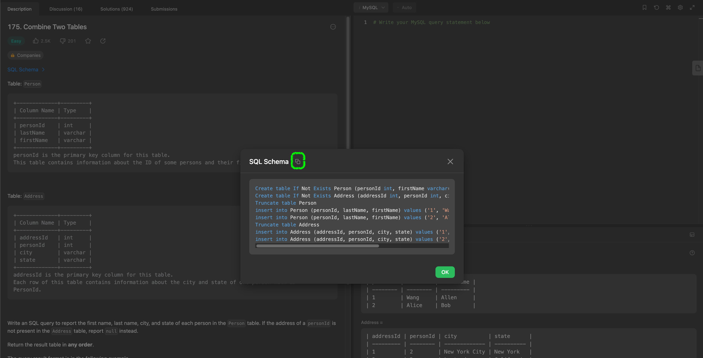

# 環境構築

- [VSCode で SQL を書く環境を整えて、LeetCode の問題を解く](https://zenn.dev/tekihei2317/articles/c9c04cea062e06)

# 問題を解く前に

1. mysql の起動

```sh
docker-compose up -d
```

2. 問題のファイルを作成

```sh
filename: {id}_{difficulty}_{title}.sql
```

3. 問題に合わせてスキーマ生成



4. 問題をといてローカルで実行、目指す答えが確認できたら leetcode で実行

- [LeetCode database Problems](https://leetcode.com/problemset/database)

5. 終了時は mysql を落とす

```sh
docker-compose down
```
